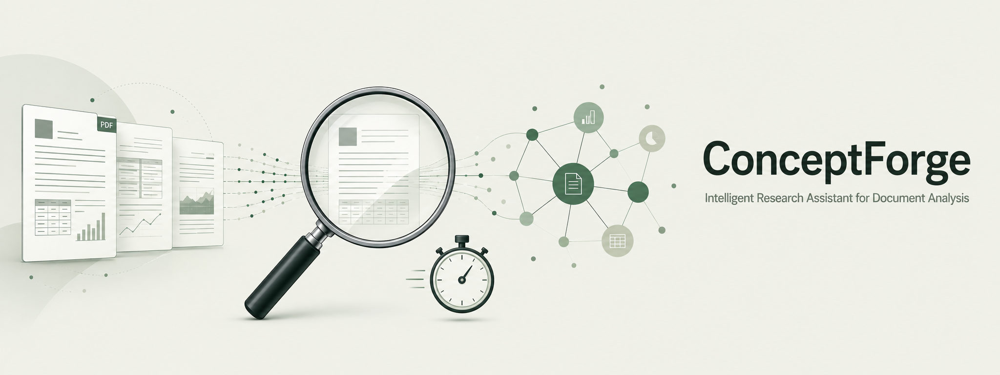
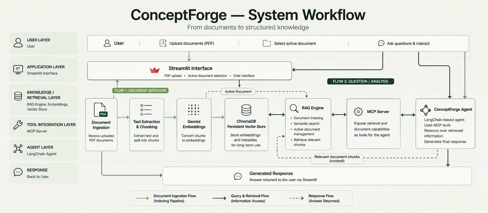
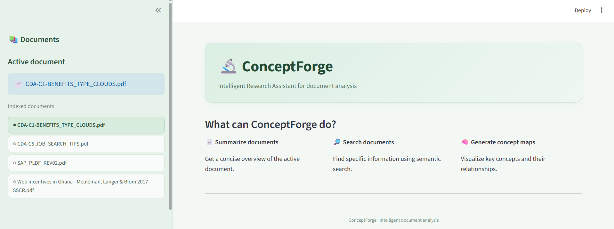
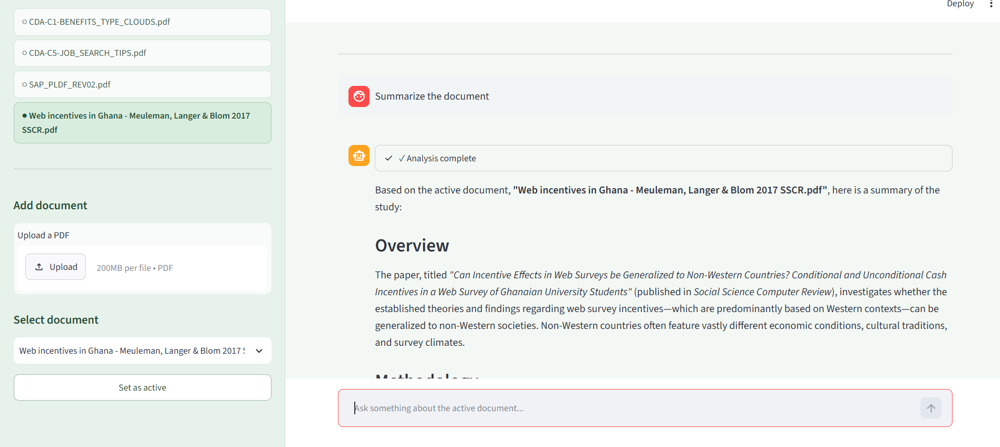

# ConceptForge

> **Project Signature**
> *From documents to structured knowledge through agentic AI.*



## Project Overview

ConceptForge is an **agentic research assistant for document analysis** that combines Retrieval-Augmented Generation (RAG), Model Context Protocol (MCP), and LLM-based agent orchestration.

The system allows users to upload PDF documents, build a persistent semantic index, select an active document, and interact with an AI agent that can retrieve relevant information from the selected document and transform it into structured knowledge.

The project was developed as a practical exploration of **agent architectures, tool integration, semantic retrieval, and document-grounded AI systems**.

---

## Repository Identity

| Attribute                | Description                   |
| ------------------------ | ----------------------------- |
| **Discipline**           | AI Engineering & Data Science |
| **Domain**               | Intelligent Document Analysis |
| **Programming Language** | Python                        |
| **Project Type**         | Agentic AI / RAG Application  |
| **Architecture**         | Agent + MCP + RAG             |
| **Interface**            | Streamlit                     |
| **Vector Store**         | ChromaDB                      |
| **LLM**                  | Google Gemini                 |
| **Project Status**       | Completed                     |
| **License**              | MIT                           |

---

## Why This Project Matters

Large language models can generate fluent answers, but a useful research assistant also needs to work with **specific source material**, retrieve relevant information, and maintain a clear relationship between the user's question and the underlying documents.

ConceptForge addresses this problem by separating the system into distinct components:

* **RAG** handles document ingestion and semantic retrieval.
* **ChromaDB** provides persistent vector storage.
* **MCP** exposes document operations as tools.
* **The agent** decides when and how to use those tools.
* **Streamlit** provides the user-facing interface.

This architecture makes the system more modular than a simple chatbot and provides a practical example of how modern AI components can be integrated into a reproducible application.

---

## Core Capabilities

ConceptForge currently provides three main capabilities:

### 1. Document Summarization

The agent can analyze an indexed PDF and produce a structured summary based on the retrieved document content.

### 2. Semantic Document Search

Users can ask questions about the active document. The RAG engine retrieves semantically relevant chunks from the selected source before the agent generates its response.

### 3. Concept Map Generation

The system can transform information extracted from a document into a structured conceptual representation, helping users identify relationships between the main ideas.

---

## Architecture



ConceptForge follows a modular architecture:

```text
                         ┌─────────────────────┐
                         │      Streamlit      │
                         │    User Interface   │
                         └──────────┬──────────┘
                                    │
                                    ▼
                         ┌─────────────────────┐
                         │   ConceptForge      │
                         │       Agent         │
                         │ LangChain/LangGraph │
                         └──────────┬──────────┘
                                    │
                                    ▼
                         ┌─────────────────────┐
                         │     MCP Server      │
                         │      FastMCP        │
                         └──────────┬──────────┘
                                    │
                                    ▼
                         ┌─────────────────────┐
                         │     RAG Engine      │
                         │  Semantic Retrieval │
                         └──────────┬──────────┘
                                    │
                                    ▼
                         ┌─────────────────────┐
                         │      ChromaDB       │
                         │ Persistent Vector   │
                         │       Store         │
                         └─────────────────────┘
```

The architecture separates **reasoning, tool access, retrieval, and persistence**, allowing each layer to perform a clearly defined role.

---

## How It Works

### 1. Document Ingestion

A PDF is uploaded through the Streamlit interface.

The RAG engine:

1. reads the document;
2. extracts its textual content;
3. divides the document into chunks;
4. generates embeddings;
5. stores the resulting vectors in ChromaDB.

The vector index is persistent, so indexed documents remain available between application sessions.

### 2. Document Selection

Multiple documents can coexist in the same persistent index.

The user can select which document should be considered the **active document**.

The active document is maintained by the RAG layer and restored when the application starts again.

### 3. Agent Interaction

The user interacts with the ConceptForge agent through the Streamlit interface.

The agent can access document-related functionality through MCP tools rather than directly manipulating the underlying RAG implementation.

### 4. Retrieval

When information is required, the RAG engine performs semantic search over the active document.

This document-scoped retrieval is important because it prevents a query about one selected document from automatically mixing information from unrelated indexed documents.

### 5. Response Generation

The retrieved context is passed back to the agent, which uses the available information to produce the final response.

This creates the following conceptual flow:

```text
User Question
      ↓
ConceptForge Agent
      ↓
MCP Tool
      ↓
RAG Retrieval
      ↓
Active Document
      ↓
Relevant Chunks
      ↓
Agent Reasoning
      ↓
Structured Response
```

---

## Technology Stack

### Python

The complete application is implemented in Python.

### Streamlit

Streamlit provides the interactive web interface, including:

* document upload;
* active document selection;
* chat interaction;
* application status;
* document management.

### LangChain / LangGraph

The agent layer uses LangChain and LangGraph components for:

* agent creation;
* tool integration;
* state management;
* conversation handling;
* middleware.

### Model Context Protocol

The project uses **MCP** to expose document operations as tools that the agent can discover and invoke.

The MCP server is implemented using **FastMCP**.

This creates a separation between the agent and the underlying document-processing implementation.

### ChromaDB

ChromaDB provides persistent vector storage for the document embeddings.

This allows indexed documents to survive application restarts without rebuilding the complete index.

### Google Gemini

Gemini is used for the language model and embedding capabilities.

The embedding model used by the RAG layer is:

```text
gemini-embedding-001
```

---

## Key Engineering Decisions

### Persistent Vector Storage

The initial implementation used an in-memory vector store.

This was replaced with ChromaDB because the application needs indexed documents to persist between sessions.

### Active Document State

The system maintains an explicit active document instead of searching indiscriminately across all indexed sources.

This provides a clearer document boundary for retrieval and improves the reliability of document-specific questions.

### MCP Tool Layer

Document operations are exposed through MCP instead of being embedded directly into the agent logic.

This provides a cleaner separation between:

```text
Agent reasoning
      ↓
Tool interface
      ↓
Document operations
```

### Asynchronous Agent Execution

MCP tool discovery and invocation are asynchronous.

The Streamlit application therefore uses asynchronous agent execution to communicate correctly with the MCP-based tool layer.

### Modular Architecture

The application separates responsibilities across dedicated modules:

```text
main.py
    │
    ├── Streamlit interface
    │
    ▼
agent.py
    │
    ├── Agent configuration
    ├── Agent state
    └── Middleware
    │
    ▼
mcp_server.py
    │
    └── MCP tools
    │
    ▼
rag_engine.py
    │
    ├── Document ingestion
    ├── Embeddings
    ├── Retrieval
    └── Active document management
    │
    ▼
ChromaDB
```

---

## Example Workflow

A typical ConceptForge session follows this workflow:

```text
Upload PDF
    ↓
Index Document
    ↓
Select Active Document
    ↓
Ask Question
    ↓
Retrieve Relevant Context
    ↓
Agent Processes Context
    ↓
Generate Answer / Summary / Concept Map
```

The user can repeat this process with multiple documents while maintaining a persistent index.

---

## Interface

The application provides a dedicated interface for document analysis.



The interface combines document management and conversational interaction in a single workspace.

---

## Document Analysis

ConceptForge can retrieve information from indexed documents and transform it into structured outputs such as summaries and conceptual representations.



---

## Repository Structure

```text
conceptforge/

├── docs/
│   ├── conceptforge-document-analysis.png
│   └── conceptforge-interface.png
│
├── samples/
│   └── Web incentives in Ghana - Meuleman, Langer & Blom 2017 SSCR.pdf
│
├── src/
│   ├── __init__.py
│   ├── agent.py
│   ├── main.py
│   ├── mcp_server.py
│   └── rag_engine.py
│
├── .gitignore
├── README.md
└── requirements.txt
```

### Folder Purpose

| Component           | Purpose                                                                  |
| ------------------- | ------------------------------------------------------------------------ |
| `src/main.py`       | Streamlit application and user interface                                 |
| `src/agent.py`      | ConceptForge agent configuration and state                               |
| `src/mcp_server.py` | MCP server and document-analysis tools                                   |
| `src/rag_engine.py` | Document ingestion, embeddings, retrieval and active-document management |
| `samples/`          | Example document for testing                                             |
| `docs/`             | Repository screenshots and documentation assets                          |

Local runtime data such as uploaded documents, ChromaDB storage, environment variables, and active-document state are intentionally excluded from version control.

---

## Installation

Clone the repository and create a Python virtual environment:

```bash
git clone https://github.com/Koffre/conceptforge.git
cd conceptforge

python -m venv .venv
```

Activate the environment on Windows:

```bash
.venv\Scripts\activate
```

Install the dependencies:

```bash
pip install -r requirements.txt
```

Create a `.env` file containing the required Google API key:

```text
GOOGLE_API_KEY=your_api_key
```

---

## Running ConceptForge

Start the Streamlit application from the repository root:

```bash
streamlit run src/main.py
```

Then open the local Streamlit address shown in the terminal.

---

## Usage

### Upload a Document

Use the **Upload a PDF** control in the sidebar.

ConceptForge indexes the document and adds it to the persistent document collection.

### Select a Document

Use the **Active document** selector to choose which indexed document should be used for document-specific retrieval.

### Interact with the Agent

Ask questions such as:

```text
Summarize this document.
```

```text
What are the main findings?
```

```text
What is the central idea of this document?
```

```text
Generate a concept map of the main ideas.
```

The agent uses the MCP tools and RAG layer to retrieve information from the active document.

---

## Project Status

**Completed**

The current implementation includes:

* persistent ChromaDB indexing;
* PDF document ingestion;
* semantic retrieval;
* active document management;
* MCP server integration;
* agent-based interaction;
* asynchronous MCP tool execution;
* Streamlit interface;
* document summarization;
* concept map generation;
* persistent document state;
* modular project structure.

The repository represents a functional prototype of an agentic document-analysis system rather than a production deployment.

---

## Skills Demonstrated

* Agentic AI Architecture
* Retrieval-Augmented Generation (RAG)
* Model Context Protocol (MCP)
* Semantic Search
* Vector Databases
* LLM Integration
* LangChain
* LangGraph
* FastMCP
* ChromaDB
* Google Gemini
* Python
* Streamlit
* Asynchronous Programming
* State Management
* Modular Software Architecture
* Document Processing

---

## What I Learned

ConceptForge was developed as a practical project for understanding how individual AI components can be combined into a functional system.

The project provided hands-on experience with:

* designing an agent around tool use;
* exposing application capabilities through MCP;
* implementing persistent semantic retrieval;
* managing state across application sessions;
* integrating asynchronous tools into a Streamlit application;
* separating retrieval logic from agent reasoning;
* debugging interactions between multiple asynchronous components.

The most important architectural lesson was that an effective AI application is not simply an LLM connected to a prompt. The reliability of the system depends on how **retrieval, tools, state, and reasoning are separated and coordinated**.

---

## Future Extensions

Potential extensions include:

* richer document metadata management;
* improved source citation and provenance;
* additional document formats;
* more advanced concept-map visualization;
* evaluation datasets for retrieval quality;
* automated retrieval and response evaluation;
* deployment as a multi-user application.

These represent possible future directions rather than current project requirements.

---

## Portfolio Author

**Joffre E. Sánchez Cerón**

MSc Statistics and Data Science
Hasselt University

**Applied Statistics | Data Science | AI Solutions**

[LinkedIn](www.linkedin.com/in/joffre-sanchez) · [GitHub](https://github.com/Koffre)

---

*Transforming complex problems into structured, data-driven solutions.*
